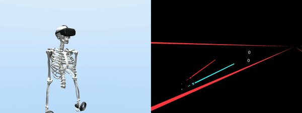

# VR Beat Saber - Audio Extension

This project extends the Beat Saber-style VR game in the **SIM2VR** framework with auditory processing functions. This integration enables automated biomechanical testing in auditory cues through simulated users that can physically interact with the VR environment.

---

## Overview

The VR Beats game allows players to slice through incoming boxes using dual lightsabers, while the SIM2VR framework enables automated testing by simulating a biomechanical user model that can interact with the game just as a real user would. This creates a closed interaction loop between the simulated user and the same VR application that real users interact with.


> **Video Credit:** VR Beat Saber with medium effort cost by [Fischer et al. (2024)](https://github.com/fl0fischer/sim2vr)

---

## Features

- Beat Saber-style gameplay with dual lightsabers  
- Incoming beat boxes that must be sliced in the correct direction  
- Score calculation based on hit accuracy and timing  
- Integrated SIM2VR framework for automated biomechanical testing  
- Visual cues for the simulated user through an RGB-D camera  
- Proprioception signals for joint angles and muscle states
- **Auditory cues** enabled using the [ml-audio-sensor](https://github.com/mbaske/ml-audio-sensor) package

---

## Requirements

- Unity 2021.3 or newer (with OpenXR plugin v1.5.3+)  
- VR Beats Kit (available on Unity Asset Store)  
- SIM2VR Asset (from sim2vr repository)  
- Python 3.8+ for UitB (User-in-the-Box) framework  
- MuJoCo physics engine  

---

## Installation
```
git clone https://github.com/Leahh147/VR-beat-saber.git
```

---

## How to set up the auditory processor
- Import [ML-Agents](https://docs.unity3d.com/Packages/com.unity.ml-agents@3.0/manual/) in Unity Package Manager and [ml-audio-sensor](https://github.com/mbaske/ml-audio-sensor) under the `Asset/VRBeatsKit` folder
- Create an `AudioModeManager` in the Unity game and attach the `Audio Sensor Component` to the `AudioModeManager`
- Modify `SimulatedUser.cs` and `RLEnv_VRBeat_SaberStyle.cs` by adding `audioData`, `audioModeOn` and `audioModeManager`
- Set the pitch in accordance with the time scale
- By choosing the sample and the signal type in the config file, you can process the auditory signals using the `AudioProcessor` and `2D/3D Audio Encoder` in the UitB module

## Training Simulated Users

### Configuration

A config file defines all the simulation parameters, including the biomechanical model, task environment, perception modules, and RL algorithm settings.

### Running Training

Training can be initiated from the command line using the configuration file. Parameters such as effort weight can be adjusted to simulate different types of players in the config file:

- Low effort cost (1e-3): explorative player  
- Medium effort cost (1e-2): average player  
- High effort cost (5e-2): conservative player

#### Training using command lines
```
python uitb/train/trainer.py uitb/config/mobl_arms_beatsvr_bimanual.yaml
```
The simulator will be stored in the `simulators` folder.

---

## Evaluation

After training, policies can be evaluated using checkpoints. Options include:

- Running evaluations with or without rendering  
- Recording videos during evaluation
- Specifying the output folders etc.

#### Evaluation
```
python uitb/test/evaluator.py simulators/beatsvr_neural_1e3 --record --num_episodes 10
```

---

## Understanding Simulated User Behavior

Behavior of the simulated user varies with the configured effort cost:

- **High effort cost (e.g., 5e-2):** Minimal arm movement, energy-conserving strategies  
- **Medium effort cost (e.g., 1e-3):** Balanced behavior  
- **Low effort cost (e.g., 1e-4):** Exaggerated, expressive arm movements  

This can be used to simulate different user profiles in VR environments.

---

## Training Time and Resources

- ~100 million steps recommended for a full training cycle  
- Training time: ~48–72 hours with a good GPU  
- Requires 3–4 GB GPU memory  
- Training is parallelized and supports multiple workers  
- Simulation speed-up is configurable by adjusting `time_scale` in the config file

---

## Future Implementation
The audio extension currently only has limited analytical ability. To better fit the auditory cues with the game, refer to the [Temporal Task](https://github.com/Leahh147/TemporalTask) to investigate how timed audio cues can improve user performance. In the future, more complex policy architecture can be implemented, such as RNN or LSTM, so that the agent can memorize the past information.

## Acknowledgements
- **VR-beat-saber** by the research group at University of Bayreuth
- **SIM2VR framework** by Fischer et al.  
- **User-in-the-Box (UitB)** framework by Ikkala et al.  
- **VR Beats Kit** from the Unity Asset Store  
- **MuJoCo** physics engine

---

## Note
If you have any questions, please contact Jiahao He (jh2425@cam.ac.uk).
